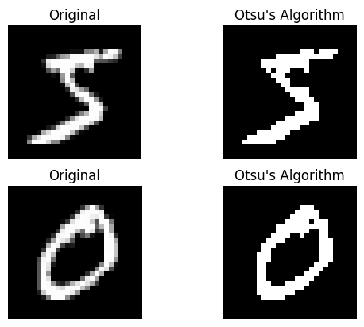
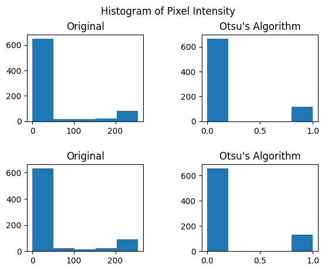

# Image Segmentation using Otsu's Method
This code implements Otsu's Method for Image Segmentation described in this paper: https://ieeexplore.ieee.org/document/4310076. The goal of this code is to calculate the threshold in the image gray scale that maximizes the difference between the object and the background, or in other words, that will separate the object from the background.

## Dataset
The dataset used to test the implementation of this method is the MNIST dataset, available as part of the torchvision library. More information on the dataset can be found here: https://yann.lecun.com/exdb/mnist/

## Implementation
The code calculates the max between class variance $\sigma_{B}^2$ among all gray scale levels k and uses that to segment the image. The formula used for between class variance $\sigma_{B}^2$ is:

$$\sigma_{B}^2 \(k \) = \frac {\[\mu_T \omega\(k\) - \mu\(k\) \]^2} {\omega\(k\) \[ 1 - \omega\(k\) \]}$$

where:

k: gray scale level.

$\omega\(k\)$: Probability of k gray scale levels from 1 to k.

$\mu\(k\)$: Mean gray level up to k level

$\mu_T$: Total mean gray level of the original picture

## Results
In the Figure below it is possible to see the implementation of the code. The picture on the left represents the original gray image, with different gray levels. Most of the image is black and the number is white, however, around the edges of the number it is possible to see some gray pixels. The picture on the right represents the new image generated, with the digit segmented from the background. In the picture generated there are only black and white pixels. Nothing in between.

The Figure below shows the histogram of the intensity of pixels in each of the images shown above. The original image has pixel intensity values from 0 to 255, most of which are either 0 or 255, however, there are some gray levels which can be seeing in the middle bins of the histogram, making it harder to determine what is the best level to apply thresholding. The image generated after the application of the Otsu's algorithm has pixel intensity values between 0 and 1, it is thus a binary image, which is automatically separated between background and foreground.

## References
[1] Li Deng. The mnist database of handwritten digit images for machine learning research. IEEE Signal Processing Magazine, 29(6):141–142, 2012. 1.

[2] NOBUYUKI OTSU. A threshold selection method from gray-level histograms. IEEE TRANSACTIONS ON SYSTEMS, MAN, AND CYBERNETICS, (1), 1979.
